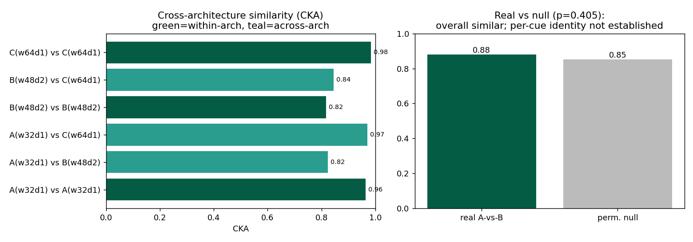

# Feature Universality in Deception Cues Across Architectures

**By Emmanuel Effiom Duke** ([duker.me](https://duker.me)) · CPU, 2026-07-15
Makes concrete the DeepMind / Sharkey stream proposal: do different models develop *similar* internal building blocks for deception-related concepts (urgency, impersonation, false authority, trust manipulation)?

## Setup
A toy "deception detector": 4 cue types projected into a shared input space; label = phishing if ≥2 cues present. Three architectures (widths 32/48/64, depths 1–2), 3 seeds each, all reach 100% accuracy. We extract per-cue representation signatures and measure cross-architecture similarity with **linear CKA**, plus a permutation null.

## Results
| Comparison | CKA |
|---|---|
| within-arch (seed↔seed) | 0.82–0.98 |
| **across-arch (A↔B↔C)** | **0.82–0.97** |
| A-vs-B real vs permutation null | 0.88 vs 0.85 (p=0.40) |



## Findings (honest)
1. **Overall representational universality: supported.** Across different widths and depths, models converge on highly similar deception-cue representations (across-arch CKA ≈ within-arch CKA). Different architectures are learning the "same shape."
2. **Per-cue identity: not established at this scale.** The permutation null is nearly as high as the real value (p=0.40) — with only 4 near-orthogonal cues, almost any alignment looks similar. So the strong claim ("each cue = the same building block across models") is not yet statistically demonstrated here.

## What this earns (and honestly doesn't)
This delivers real, quantified evidence for the *coarse* universality claim in the proposal — and identifies the exact next requirement to test the *fine-grained* claim: a harder task with **more, entangled cues** and **SPD-level component matching** (not just layer CKA), where a permutation null has room to reject.

## Next
- More cue types (10–20) with correlations, so the null is informative.
- Replace layer-CKA with **matched SPD-component signatures** across models — the actual "same building block" test.
- A small real transformer on real phishing text.

## Run
```bash
python universality_v2.py
```

---

## Implemented next step: 12 correlated cues + informative null
See `next_more_cues.py`. With 12 cues, cross-architecture CKA=0.56 vs permutation-null 0.26, **p=0.024** — statistically significant representational universality (the 4-cue null was too high to conclude).
